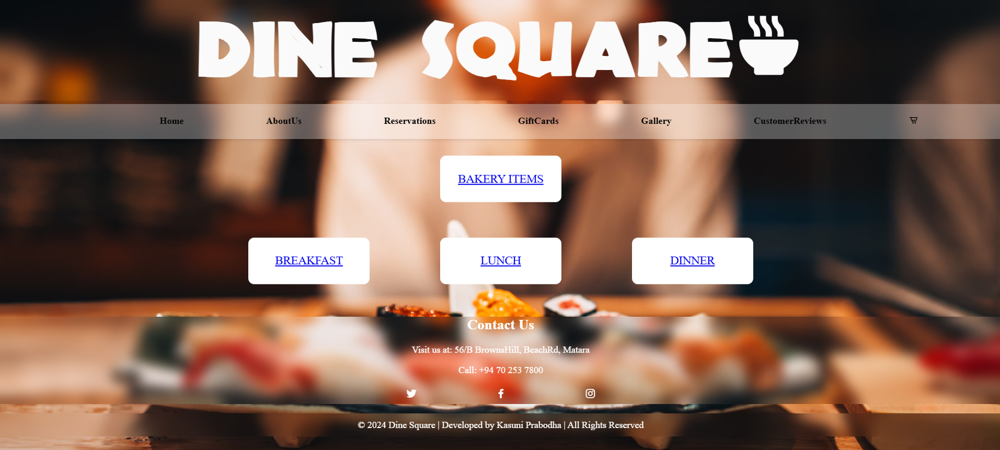
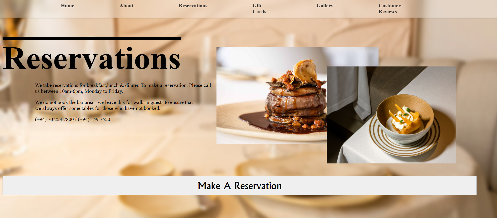
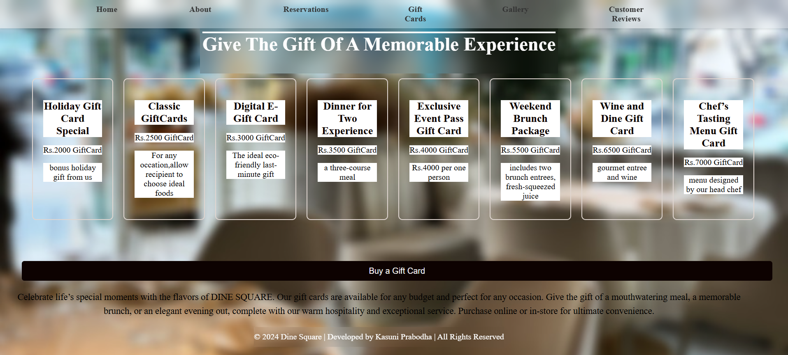

# 🍽️ Dine Square - Smart Dining Experience

Smart Dining: The Future of Restaurant Experiences. A modern, user-friendly restaurant front-end solution designed for elegance and efficiency.

## 📺 Live Demo
You can view the live interface (UI) of this website here:
[Dine Square Restaurant - Live Website](https://kasuniprabodha.github.io/Dine-Square-Restaurant-Website/)

## ✨ Features
- **User Profiles:** Personalized experience starting with profile creation.
- **Table Reservations:** Seamless booking with date, time, and guest count.
- **Digital Gift Cards:** A variety of gift options from Holiday Specials to Chef’s Tasting Menus.
- **Culinary Team:** Meet the expert chefs behind the menu.
- **Google Maps Integration:** Easily find the restaurant location in Matara.
- **Customer Feedback:** A dedicated section for diner reviews.

## 💻 Tech Stack
- **Languages:** HTML, CSS, JavaScript
- **Graphics:** Adobe Illustrator (Logo and Graphics)
- **Deployment:** GitHub Pages

## 📸 Screenshots

## 🗺️ Location
Located at: **56/B BrownsHill, BeachRd, Matara.**

---
© 2024 Dine Square | Developed by Kasuni Prabodha
